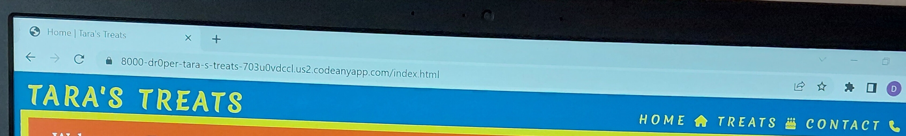
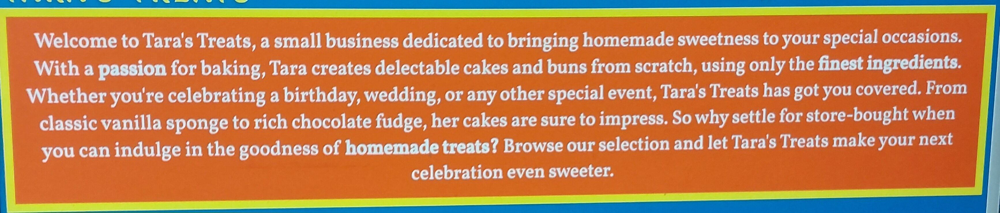
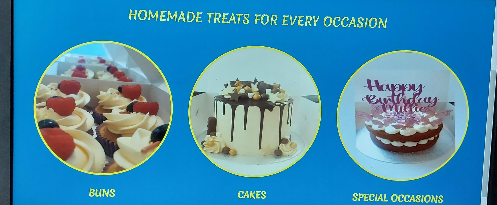
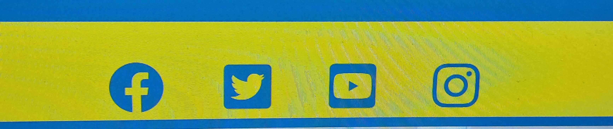
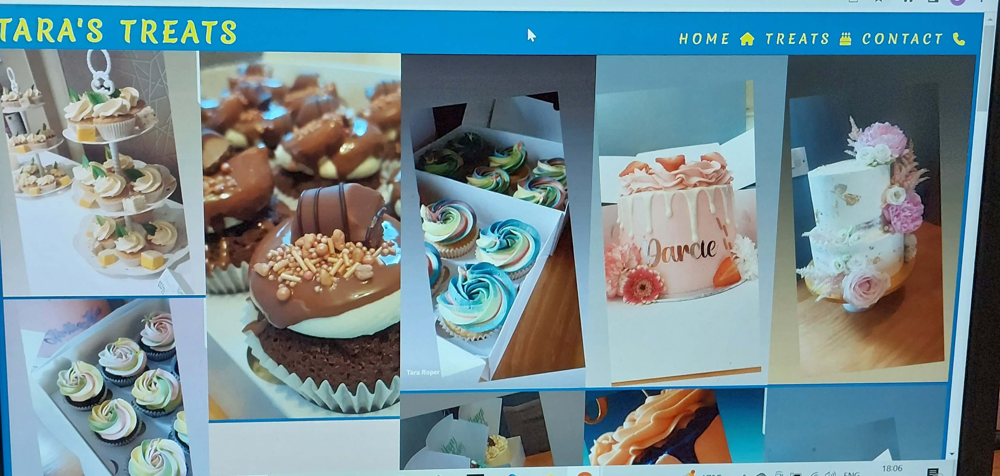
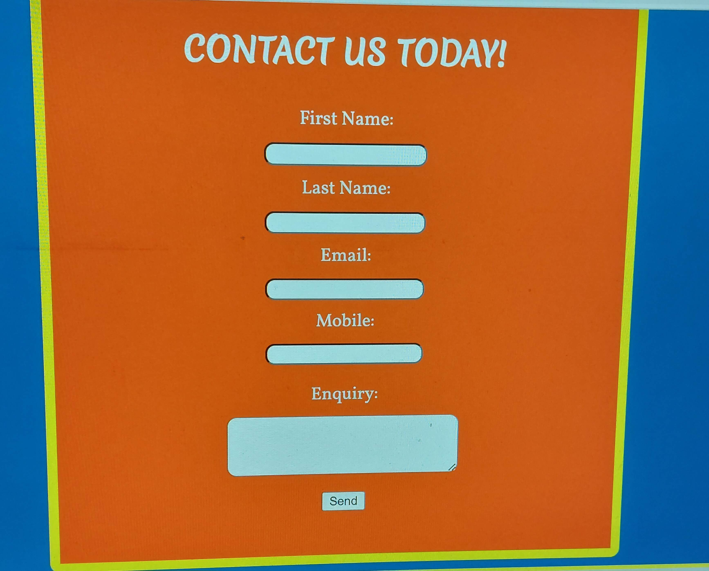
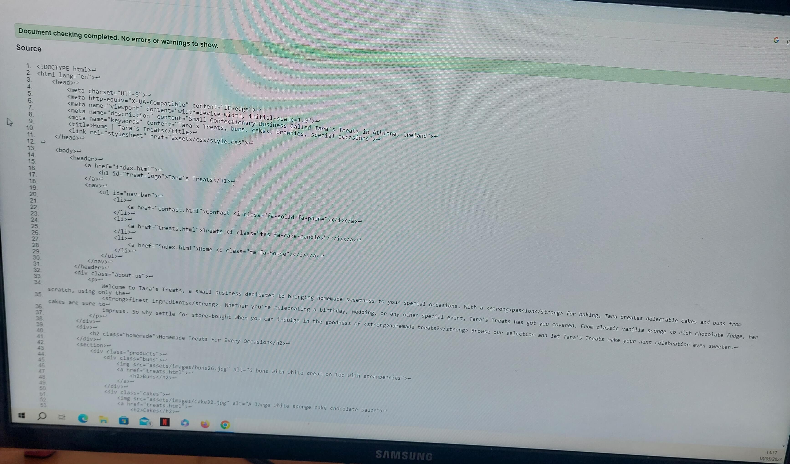
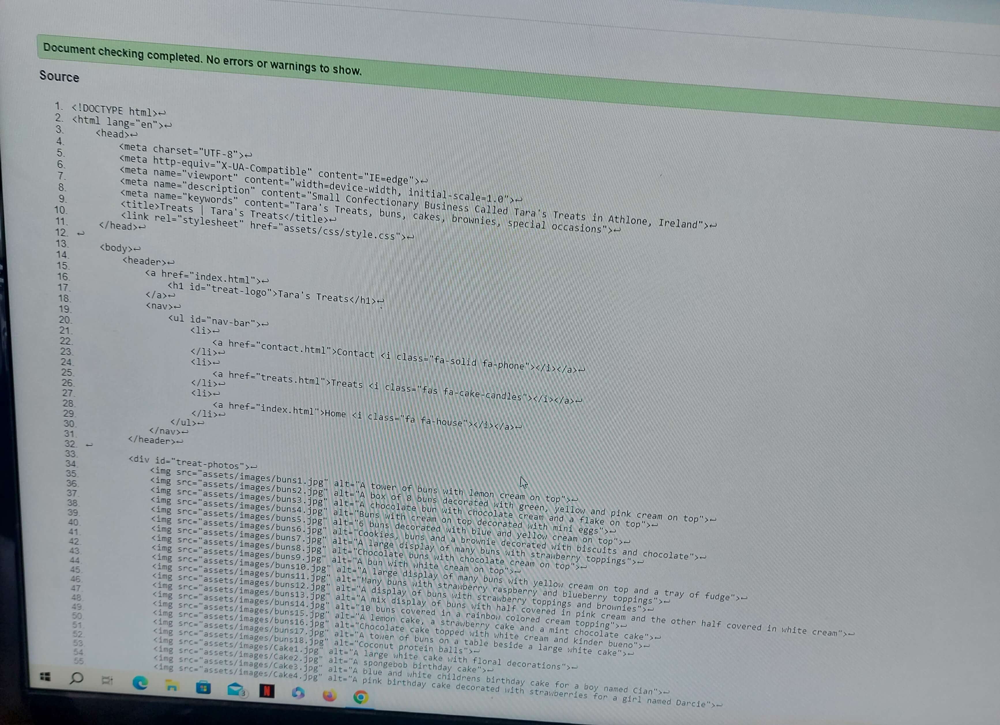
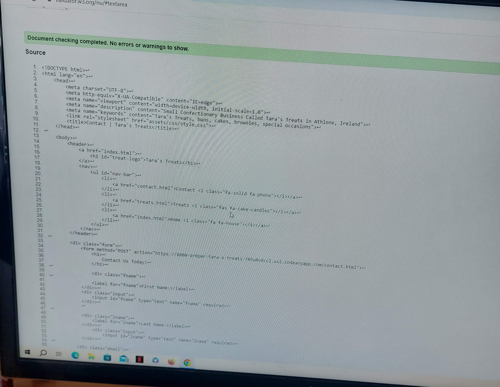
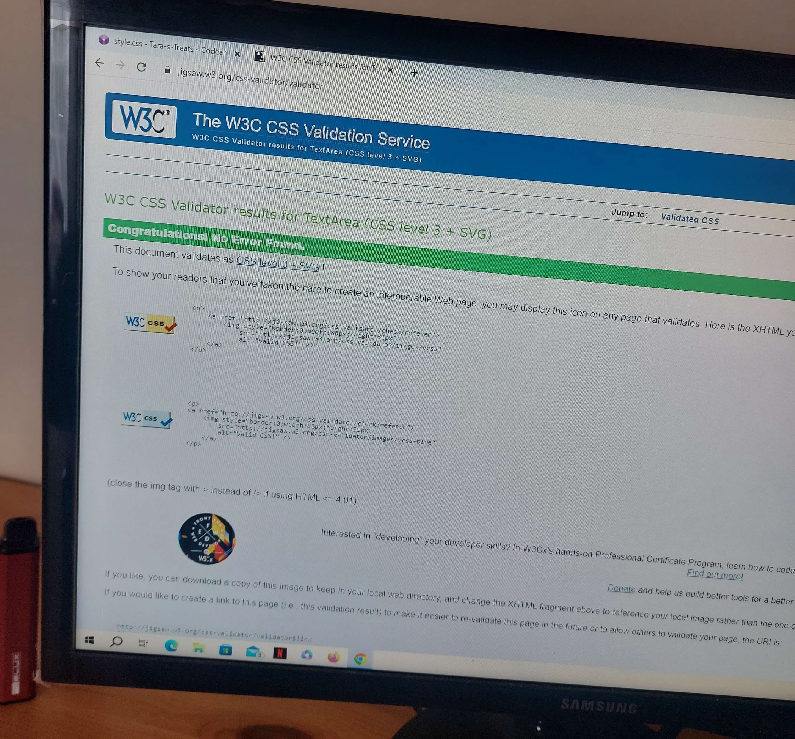

# Tara's Treats

Welcome! Tara's Treats is a simple but effective website showcasing Tara's skills as a confectionary artist. As you navigate the site, you will become aware of the different products that are on offer and for which different events the products are tailored for such as Birthdays, Weddings and Christenings. 

Tara's Treats as a website will be useful for anyone interested in buying custom homemade Buns, Cakes, Fudge, Brownies etc for either themselves or for someone else.

## Features

### 1. Navigation Bar

+ As seen on all pages of the website, the nav bar is fully responsive and contains a clickable link to the Logo, Home, Treats and Contact pages and appears the same on all pages.
+ The Nav Bar allows the user to freely manoeuvre around the website on all devices without having to use the back button to access each page.

### 2. Introductory Section

+ This section clearly indicates to the user what Tara's Treats is all about. It explains to the user what type of business it is, what the business does and introduces the user to the selection of products.
+ The section also grabs the attention of the user with its eye catching colored background with a contrasting border.

### 3. Products Section

+ This section contains 3 responsive div elements styled using flexbox showcasing some of the different products that are available on Tara's Treats.
+ Each section contains a clickable h2 link that changes color when hovered over that will bring the user to the Treats Section of the webpage.
+ Each image in each section also tranfroms when hovered over to increase user interactivity.

### 4. Footer

+ The footer section also includes clickable links to the different Social Media sites for Tara's Treats.
+ The links will also open in a new tab that will allow users to stay on the main site while also navigating to the Social Media sites.
+ Both the facebook and instagram will link to actual live IRL pages for Tara's Treats. 
+ I hope to add both Twitter and Youtube links in the future.

### 5. Treats Section

+ The Treats Section is a showroom showcasing a myriad of pictures of all the different products that Tara's Treats has on offer.
+ With it's responsive design , users will appreciate the interactivty with the pictures as they transform when hovered on desktop or held down on a mobile/tablet device.
+ As there are alot of pictures, some are hidden when accessed on a mobile device so as to increase the UX.

### 6. Contact Form

+ The contact form is a simple design that allows users to get in contact with Tara's Treats if they are interested in the products.
+ Users are asked to provide Full Name, Email, Mobile Number and are able to express what they would like to enquire about in the Enquiry section provided.

## Validator Testing

### 1. HTML

Throughout the course of building this website, I periodically tested each page and feature on Desktop/Tablet and Mobile Devices.
As far as I am aware, all pages and features including the Tara's Treats Logo, NavBar, Products Section hover effect and clickable Links, the Footer hover effects and clickable links, the Treats section and hover effects including CSS styling rules which hide certain images when viewed on mobile devices and the Contact form are all 100% working on all devices. 

I tested them myself on 3 seperate devices and I got friends and family to open the sites on their devices and the results are the same. All pages and features work as intended on Desktop/Tablet/Mobile Devices. 

There were no errors returned when passing through the official W3C validator.

### 2. CSS

I also periodically tested the CSS on each page and features to see if the CSS syling rules worked on all devices.
As far as I am aware, all pages and features work and appear correctly on each seperate device.

There were no errors found when passing through the official Jigsaw Validator.

## Deployment 

The site was deployed to Github pages. The steps I took to deploy were as follows:

+ In my GitHub repository, navigate to Settings.
+ In code and automation section, click on the Pages button
+ In the GitHub Pages section, select Main Branch and root folder and click save.
+ From there the page will automatically refresh and a live link will appear.

The live link can be found here - [Tara's Treats](https://dr0per.github.io/Tara-s-Treats/).

## Credits 

+ The text for the Introductory Section was created using ChatGPT by prompting it with certain information about Tara's Treats.
+ Instructions on how to implement form validation was learned throughout my participation in the Love Running project by Code Institute.
+ The design for the layout of the Treats Section was also inspired by the Gallery Section in the Love Running project by Code Institute. 
+ The icons in the NavBar and Footer were taken from Font Awesome.
+ The photos used in the Products Section were obtained from Tara the official owner of Tara's Treats.
+ The images used in the Treats Section were also obtained from Tara the offcial owner of Tara's Treats.